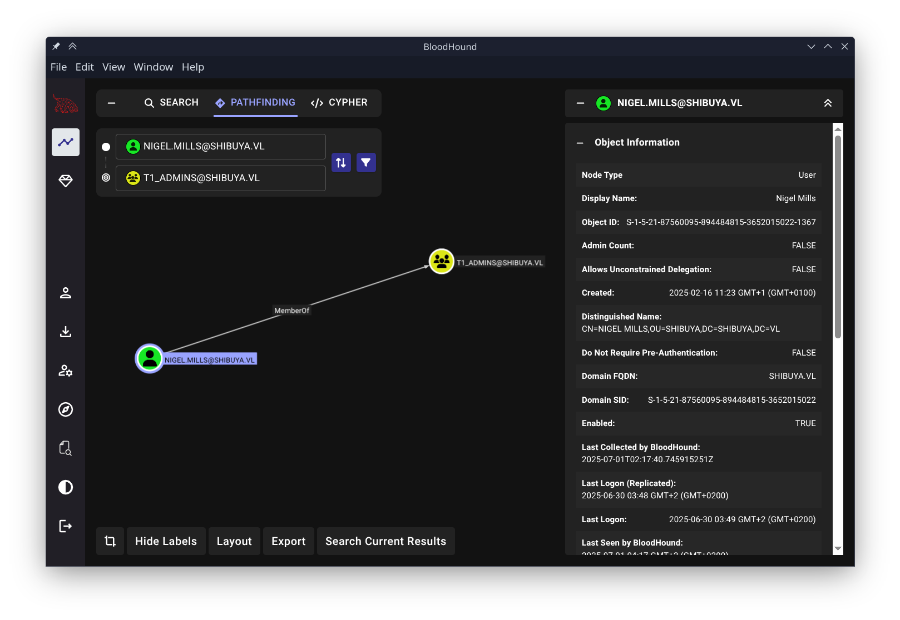

# BloodHound-CE-Desktop

<br>

A lightweight Electron-based desktop application for accessing the Bloodhound Community Edition (BHCE) web interface, providing a native-like experience for users of Bloodhound CE running locally at `http://localhost:9090`. This application is designed to be cross-platform.

<br>

## Overview

BloodHound-CE-Desktop wraps the Bloodhound CE web interface in an Electron application, allowing users to interact with BHCE in a standalone desktop window. It loads `http://localhost:9090`, where the BHCE web server is exposed, typically via a containerized setup (e.g., Podman or Docker).

<br>

## Prerequisites

- **Bloodhound CE Instance**: A running BHCE instance accessible at `http://localhost:9090`. This can be set up using Podman, Docker, or a manual installation.
- **Node.js and npm**: Required for building and running the Electron app.
  - Recommended: Node.js 20 or later (e.g., 22.14.0).
- **Electron**: Version 36 is used for compatibility (specified in `package.json`).
- **Git**: For cloning the repository (optional if downloading manually).

<br>

## Screenshots

#### Main Window


<br>

## Installation and Setup

### General Setup (Linux, macOS, Windows)

<br>

1. **Clone the Repository**:
   ```bash
   git clone https://github.com/Red-Flake/BloodHound-CE-Desktop.git
   cd BloodHound-CE-Desktop
   ```

<br>

2. **Install Node.js and npm**:
   - **Linux**:
     - Ubuntu/Debian: `sudo apt install nodejs npm`
     - Fedora: `sudo dnf install nodejs npm`
   - **macOS**: Use Homebrew (`brew install node`) or download from [nodejs.org](https://nodejs.org).
   - **Windows**: Download and install from [nodejs.org](https://nodejs.org).
   - Verify installation:
     ```bash
     node --version
     npm --version
     ```

<br>

3. **Install Dependencies**:
   ```bash
   npm install
   ```
   This installs Electron 36 and other dependencies listed in `package.json`. Ignore warnings about deprecated packages (e.g., `boolean`) for now.

<br>

4. **Start the Electron App**:
   ```bash
   npm start
   ```
   This launches the Electron app, loading `http://localhost:9090`.

<br>

### NixOS-Specific Setup

<br>

For NixOS users, a `shell.nix` file is provided to set up a development environment with Node.js, npm, and Electron 36, along with required system libraries.

<br>

1. **Enter the Nix Shell**:
   ```bash
   cd BloodHound-CE-Desktop
   nix-shell
   ```

<br>

2. **Install Dependencies**:
   ```bash
   npm install
   ```

<br>

3. **Start the Electron App**:
   ```bash
   npm start
   ```

<br>

<br>

## Building instructions

### Nix/NixOS

1. **Enter the Nix Shell**:
   ```bash
   cd BloodHound-CE-Desktop
   nix-shell
   ```

<br>

2. **Build the package using nix**:
   ```bash
   nix-build
   ```

<br>

## Usage

By default, the application will connect to `http://localhost:9090`. However, you can override these settings using command-line arguments.

#### Running with Default Settings
If you run the application without any arguments, it will use the default host and port:
```bash
bloodhound-ce-desktop
```

This will connect to `http://localhost:9090`.

#### Running with Custom Host and Port

To run the BloodHound-CE-Desktop application with a custom host, port, you can use the following command-line options to customize the host and port settings.

To specify a custom host and port, use the `--host` and `--port` flags. For example:
```bash
bloodhound-ce-desktop --host=example.com --port=8080
```

This command will launch the application and connect to `http://example.com:8080` instead of the default URL.

This flexibility allows you to easily switch between different environments or configurations without modifying the application code.

<br>

## Contributing

Contributions are welcome! Submit pull requests or open issues on the GitHub repository.

<br>

## License

This project is licensed under the GNU General Public License (GPL) v3.0. See the [LICENSE](LICENSE) file for details.
